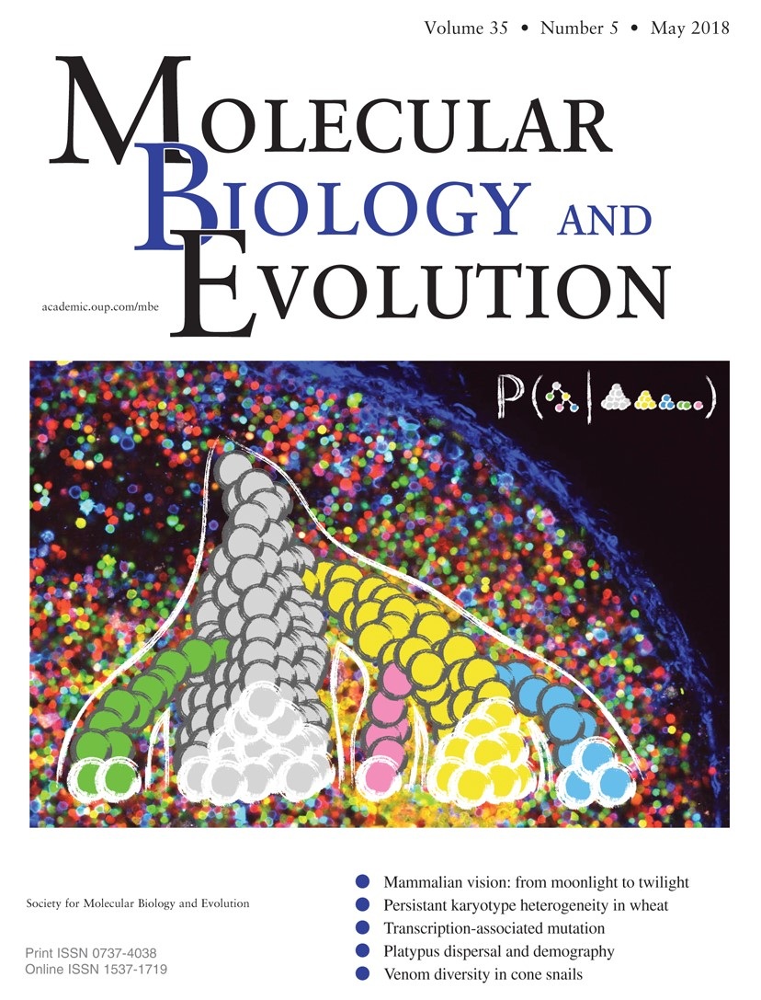

Citing gctree
#############

**Using Genotype Abundance to Improve Phylogenetic Inference**
William S DeWitt, III,  Luka Mesin,  Gabriel D Victora,  Vladimir N Minin, Frederick A Matsen, IV
*Molecular Biology and Evolution*, Volume 35, Issue 5, May 2018, Pages 1253–1265, https://doi.org/10.1093/molbev/msy020

.. code-block:: bibtex

  @article{10.1093/molbev/msy020,
   author = {DeWitt, William S, III and Mesin, Luka and Victora, Gabriel D and Minin, Vladimir N and Matsen, Frederick A, IV},
   title = "{Using Genotype Abundance to Improve Phylogenetic Inference}",
   journal = {Molecular Biology and Evolution},
   volume = {35},
   number = {5},
   pages = {1253-1265},
   year = {2018},
   month = {02},
   abstract = "{Modern biological techniques enable very dense genetic sampling of unfolding evolutionary histories, and thus frequently sample some genotypes multiple times. This motivates strategies to incorporate genotype abundance information in phylogenetic inference. In this article, we synthesize a stochastic process model with standard sequence-based phylogenetic optimality, and show that tree estimation is substantially improved by doing so. Our method is validated with extensive simulations and an experimental single-cell lineage tracing study of germinal center B cell receptor affinity maturation.}",
   issn = {0737-4038},
   doi = {10.1093/molbev/msy020},
   url = {https://doi.org/10.1093/molbev/msy020},
   eprint = {https://academic.oup.com/mbe/article-pdf/35/5/1253/25091561/msy020.pdf},
   }
